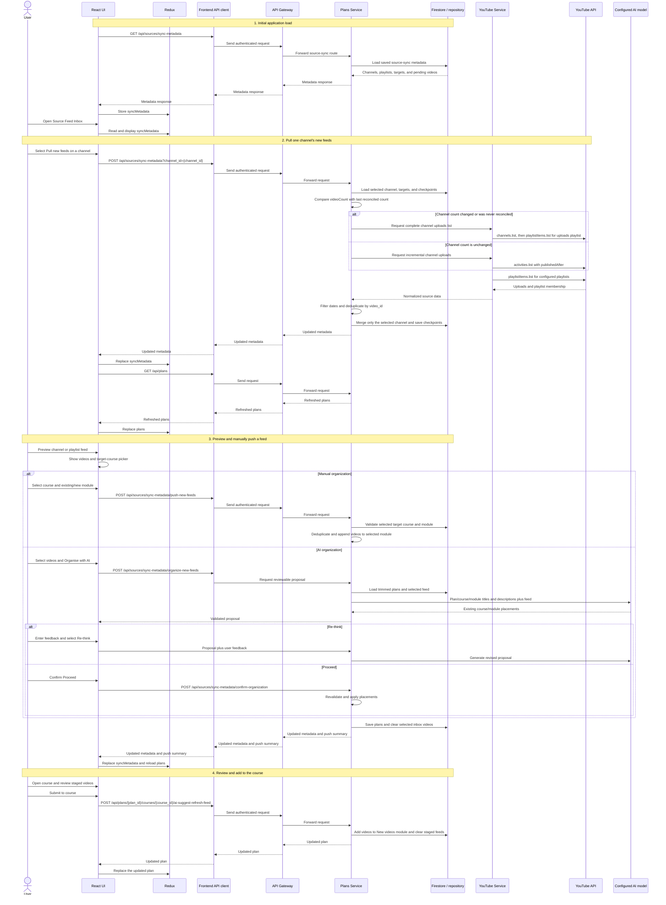

# Source Feed Inbox
## Data-load sequence



## Step-by-step behavior

### 1. Initial inbox load

1. The React application starts and calls `GET /api/sources/sync-metadata` automatically.
2. The API gateway forwards the request to the Plans service.
3. The Plans service reads the already-persisted metadata. It does not call YouTube during this request.
4. The response is saved as `sources.syncMetadata` in Redux.
5. Opening the Source Feed Inbox reads that Redux state and renders the channel and playlist list. Opening the drawer itself does not make another request.
6. Each channel header shows its own last-sync timestamp and a red badge when new videos are pending.
7. The enabled-by-default **Targets only** switch hides channels with no direct or playlist targets and hides zero-target playlists within the remaining channel cards.
8. Hovering a channel or playlist target count shows the resolved learning-plan and course names as a bulleted list.

### 2. Pull new feeds from YouTube

1. The user selects **Pull new feeds** on a channel card.
2. The UI calls `POST /api/sources/sync-metadata?channel_id={channel_id}` and shows loading only on that channel.
3. The Plans service loads persisted source-sync metadata and target courses. It does not reload every subscription for a channel-scoped request.
4. The Plans service compares the channel's `videos_count` with `last_reconciled_videos_count`.
5. If the count changed, or the channel has never been reconciled, the YouTube service reads the channel's complete uploads playlist. This comparison is based on video IDs and deliberately does not apply `last_feed_checked_at`, so older videos that became public later are not missed.
6. If the count is unchanged, the YouTube service uses the fast incremental path: `activities.list` with `channelId` and `publishedAfter = last_feed_checked_at - 24 hours`.
7. The service extracts video IDs and calls `videos.list` in batches for full metadata.
8. For each targeted playlist on the selected channel, the YouTube service calls `playlistItems.list`. YouTube does not support a date filter for this API.
9. Playlist results preserve `playlist_id`, `playlist_item_id`, `added_to_playlist_at`, and the video's original `published_at`.
10. Incremental channel results are compared using `published_at`. Full channel reconciliation uses ID comparison without a date cutoff. Playlist results are compared using `added_to_playlist_at`.
11. Videos already present in a course module or staged feed are removed by `video_id`. Existing unpushed inbox videos are merged with newly discovered videos.
12. Only the selected channel is replaced in persisted metadata; all other channels remain unchanged.
13. `last_feed_checked_at` and `last_reconciled_videos_count` are advanced only after the appropriate pull succeeds. API failures are surfaced instead of being stored as an empty feed.
14. The UI replaces the Redux metadata, reloads plans, and clears the selected channel's loading state.

The no-query version of `POST /api/sources/sync-metadata` remains available for backward-compatible API reconciliation, but the inbox does not expose a top-level **Pull all channels** action.

#### Channel upload request

Normal incremental request:

```http
GET /api/videos?channel_id={channel_id}&published_after={checkpoint_minus_24_hours}
```

The YouTube service uses:

```http
GET https://www.googleapis.com/youtube/v3/activities
    ?part=snippet,contentDetails
    &channelId={channel_id}
    &publishedAfter={checkpoint_minus_24_hours}
    &maxResults=50
```

Full reconciliation request when the channel count changes:

```http
GET /api/videos?channel_id={channel_id}
```

The YouTube service resolves the channel's uploads playlist with `channels.list`,
then paginates `playlistItems.list` and compares every returned video ID with the
IDs already present in the target learning plan and pending feeds.

#### Playlist membership fields

```json
{
  "video_id": "video-id",
  "playlist_id": "playlist-id",
  "playlist_item_id": "playlist-item-id",
  "added_to_playlist_at": "2026-07-22T08:00:00Z",
  "published_at": "2020-01-01T00:00:00Z"
}
```

`added_to_playlist_at` determines whether a playlist entry is new. This allows an older video added to a playlist today to appear in the inbox.

### 3. Preview and manually push a pending feed

1. A pending channel or playlist feed exposes a **Preview** action.
2. The full-height preview displays modern video cards and a manual destination panel.
3. The user can select one or many videos. The destination action applies only to that selection, so separate selections from the same feed can be routed to different courses.
4. Course choices are limited to the feed's configured target courses.
5. After selecting a course, the user selects one of its existing modules or enters a name for a new module.
6. **Organise with AI** sends only the selected videos and a trimmed learning-plan hierarchy to the configured default LLM.
7. The learning-plan context contains opaque IDs plus titles and descriptions for the plan, allowed target courses, and their existing modules. It excludes existing video collections and unrelated plan metadata. The feed context contains each selected video's ID, title, and description.
8. The model must place every selected video exactly once into an existing allowed course and module. The backend rejects missing, duplicate, or invented IDs.
9. The first AI response is only a proposal. The user can select **Proceed**, or enter feedback and select **Re-think** to request a revised proposal.
10. **Proceed** revalidates the proposal against current persisted data before moving videos and removing the selected IDs from the inbox.
11. For manual organization, the UI posts the selected video IDs, channel, optional playlist, selected plan/course, and existing-module ID or new-module title to `POST /api/sources/sync-metadata/push-new-feeds`.
12. The Plans service validates that every selected video is still pending, the course is a target of that feed, and the selected module belongs to it.
13. It removes video IDs already present in the learning plan, appends the remaining selected videos directly to the destination module, and creates the module when requested.
14. It removes only the selected IDs from the inbox. Unselected videos remain in the preview and can be routed separately.
15. The UI updates Redux metadata, reloads plans, and refreshes pending counters.

```json
{
  "channel_id": "channel-id",
  "playlist_id": null,
  "plan_id": "plan-id",
  "course_id": "course-id",
  "module_id": "existing-module-id",
  "new_module_title": null,
  "video_ids": ["video-id-1", "video-id-2"]
}
```

### 4. Review and submit staged videos

1. A course with staged feeds displays the yellow refresh notification.
2. The user opens the course overview and reviews the staged videos visually or as raw JSON.
3. Selecting **Submit to course** calls `POST /api/plans/{plan_id}/courses/{course_id}/ai-suggest-refresh-feed`.
4. The current temporary organizer creates or reuses the `New videos` module and adds non-duplicate staged videos.
5. The backend clears `new_video_feeds`, removes `refresh_needed`, saves the plan, and returns the updated plan.
6. Redux replaces that plan and the UI removes the staged-feed notification.

## Data ownership

| Data | Owner | Frontend state |
| --- | --- | --- |
| Channels, playlists, checkpoints, playlist membership, targets, and inbox `new_videos` | Plans service source-sync repository | `sources.syncMetadata` |
| Plans, courses, `new_video_feeds`, and `refresh_needed` | Plans service plan repository | `plans.items` |
| YouTube OAuth tokens and live YouTube catalog access | YouTube service | Not stored in Redux |
