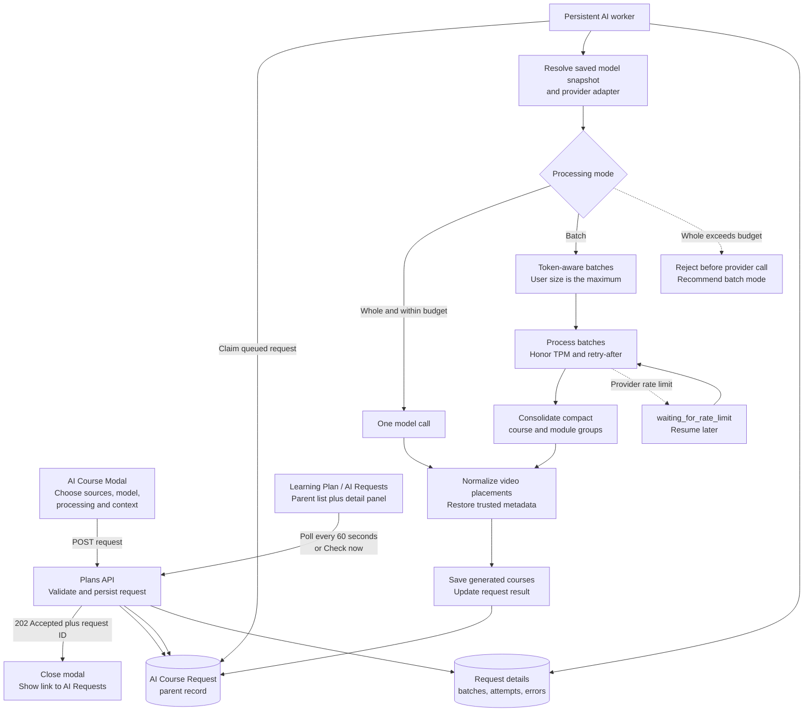

# Persistent AI Course Job Queue

## Execution order

- [x] Finalize API request/response DTOs and endpoint blueprint.
- [x] Build the AI Requests status page using mock data.
- [x] Update AiCourseModal with model, processing, and metadata options.
- [x] Add persistent AI job models and storage.
- [x] Implement submit/list/detail/retry/cancel APIs.
- [x] Add multi-provider model configuration CRUD.
- [x] Build the persistent background worker.
- [x] Add token-aware batching, rate-limit waiting, and consolidation.
- [x] Connect the UI to real APIs.
- [ ] Test restart recovery, large requests, retries, and provider failures.

## Goal

Course generation must be submitted as a durable asynchronous job. The UI waits only for a `202 Accepted` acknowledgement, closes the creation modal, and lets the user monitor the request from the learning plan's **AI Requests** page.

This design covers three related features:

1. Persistent AI course requests, background processing, and status tracking.
2. CRUD configuration for models from multiple AI providers.
3. Model, processing mode, batch size, and organization-context choices in the AI course modal.

## Architecture



## Feature 1: persistent asynchronous requests

### Submission behavior

The browser must await the short acknowledgement request; it must not wait for LLM processing and must not use an untracked fire-and-forget fetch.

```http
POST /api/plans/{plan_id}/ai-course-requests
```

Successful response:

```http
202 Accepted
```

```json
{
  "request_id": "request-uuid",
  "status": "queued",
  "status_url": "/api/plans/{plan_id}/ai-course-requests/request-uuid"
}
```

After receiving `202`, the modal closes and shows a notification with a link to the plan's AI Requests page.

### Request lifecycle

Supported statuses:

- `queued`
- `running`
- `waiting_for_rate_limit`
- `completed`
- `failed`
- `cancelled`

The request is persisted before returning `202`. LLM work must not depend only on FastAPI `BackgroundTasks`, because an application restart would lose in-memory work. A persistent worker claims queued records and updates progress after every batch.

### Parent request record

The parent record is optimized for the status-page list:

| Field | Purpose |
|---|---|
| `id`, `plan_id`, `user_id` | Identity and ownership |
| `status` | Current lifecycle state |
| `model_config_id` | Selected configuration |
| `model_snapshot` | Provider/model/options captured at submission |
| `processing_mode` | `batch` or `whole` |
| `requested_batch_size` | User-selected maximum batch size |
| `effective_batch_size` | Capacity-safe size used by the worker |
| `organization_context` | Metadata mode and description limit |
| `total_videos`, `processed_videos` | Overall progress |
| `total_batches`, `completed_batches` | Batch progress |
| `generation_mode` | `llm`, `json_fallback`, or `deterministic_fallback` |
| `error_code`, `error_message` | Safe failure summary |
| `created_course_ids` | Result references |
| timestamps | Created, started, updated, and completed times |

### Captured request details

Large details should be stored separately from the parent record so the list remains fast and Firestore's document-size limit is not approached. Details include:

- Selected channels, playlists, and video IDs.
- Input metadata snapshot or references needed to rehydrate it.
- Per-batch video IDs and progress.
- Provider attempt number and model used.
- Token estimates and available rate-limit information.
- Retry/wait timestamps.
- Full internal exception in server logs; only a safe message is exposed to the UI.
- Generated course IDs and completion summary.

### Status page

Route:

```text
/plans/:planId/ai-requests
```

The page has two sections:

1. **Parent records list** — request ID, model, video count, progress, status, creation time, and actions.
2. **Details panel** — selected sources, captured options, batch attempts, provider messages, timestamps, and generated course links.

The page polls once every 60 seconds while any visible request is active. A **Check now** button performs an immediate refresh. Polling stops when every visible request is in a terminal state.

### Status API blueprint

```http
GET  /api/plans/{plan_id}/ai-course-requests
GET  /api/plans/{plan_id}/ai-course-requests/{request_id}
POST /api/plans/{plan_id}/ai-course-requests/{request_id}/retry
POST /api/plans/{plan_id}/ai-course-requests/{request_id}/cancel
```

The list endpoint should be paginated. The detail endpoint returns the parent record plus captured request and batch details.

List response contract:

```json
{
  "items": [],
  "next_cursor": null
}
```

Retry returns a new queued request rather than mutating historical attempts:

```http
202 Accepted
```

```json
{
  "request_id": "new-request-uuid",
  "retried_from_request_id": "old-request-uuid",
  "status": "queued",
  "status_url": "/api/plans/{plan_id}/ai-course-requests/new-request-uuid"
}
```

Cancel returns the latest parent record. Cancellation is cooperative: a running provider call finishes, but its result is not persisted after cancellation.

## Feature 2: multi-provider model configurations

The proposed model configuration feature is appropriate. Model configurations are persisted records; provider credentials remain server-side environment variables or managed secrets.

Example configuration:

```json
{
  "id": "model-config-uuid",
  "name": "Groq GPT-OSS",
  "provider": "groq",
  "model": "openai/gpt-oss-20b",
  "enabled": true,
  "is_default": true,
  "temperature": 0,
  "structured_output_mode": "auto",
  "max_input_tokens": 8000,
  "default_batch_size": 30,
  "max_batch_size": 50,
  "fallback_model_config_id": null,
  "credential_status": "configured"
}
```

API blueprint:

```http
GET    /api/ai-model-configs
POST   /api/ai-model-configs
PATCH  /api/ai-model-configs/{config_id}
DELETE /api/ai-model-configs/{config_id}
POST   /api/ai-model-configs/{config_id}/test
```

Collection responses use `{ "items": [...] }`. Create returns `201`; update and test return `200`; delete returns a JSON confirmation so the shared frontend client does not need special `204` handling.

Rules:

- Never return or accept provider API keys through normal UI CRUD payloads.
- Expose only a safe credential status such as `configured` or `missing`.
- Use provider adapters behind one course-generation interface.
- Save an immutable model snapshot with each request so later edits do not alter queued work.
- Soft-delete configurations referenced by request history.
- Only enabled and successfully tested configurations appear in the creation modal.

## Feature 3: AI course creation options

### Choose AI model

The modal loads enabled model configurations and selects the configured default. The submitted request contains `model_config_id`; the backend resolves and snapshots the configuration.

### Choose processing mode

Two modes are supported:

- **Batch — recommended and default.** The user supplies a batch-size maximum. The worker may lower it using the selected model's token budget and chosen metadata mode. It must not silently increase it.
- **Whole.** One provider call is permitted only when a preflight estimate is below the model's safe request and TPM budget. Otherwise the API returns validation guidance recommending batch mode.

For example, a requested batch size of 30 may become an effective size of 10 when 200-word descriptions are included.

### Choose organization context

The proposed metadata choice is useful with the following safeguards:

| Mode | Sent to the LLM | Guidance |
|---|---|---|
| `title_only` | Video ID and title, plus source provenance | Default; smallest and safest |
| `title_tags` | Title and limited tags | Better topical grouping with moderate size |
| `full_metadata` | Title, limited tags, and trimmed description | Optional; requires token-aware batch reduction |

For `full_metadata`, description length is configurable up to **200 words per video**. Two hundred words is a ceiling, not a guarantee: the worker must trim further or reduce the effective batch size to stay within the selected model's safe token budget. Descriptions remain trusted application metadata regardless of whether they are sent to the LLM.

### Creation request blueprint

```json
{
  "model_config_id": "model-config-uuid",
  "processing": {
    "mode": "batch",
    "batch_size": 30
  },
  "organization_context": {
    "mode": "title_only",
    "description_max_words": 200,
    "max_tags_per_video": 12
  },
  "videos": [
    {
      "video_id": "video-id",
      "channel_id": "channel-id",
      "playlist_id": "playlist-id",
      "title": "Video title"
    }
  ],
  "source_channels": []
}
```

`description_max_words` is ignored unless the mode is `full_metadata`.

## Capacity and batching rules

Asynchronous processing prevents HTTP timeouts but does not remove provider limits. Before each call, the worker estimates input plus expected structured output tokens.

- Whole mode is rejected before contacting the provider when it exceeds the safe budget.
- Batch mode treats the user size as a maximum and calculates an effective size.
- Provider `retry-after` and rate-limit headers determine when a waiting job resumes.
- Batch results contain compact group IDs; a final consolidation call merges group names without resending every video's metadata.
- Original video metadata is restored from trusted state after organization.

## Implementation sequence

Implementation starts from the UI and agreed API contracts, followed by backend execution:

1. Finalize request/response DTOs and API client method signatures.
2. Build the modal options and AI Requests page against mock API responses.
3. Add persistent request storage and the `202 Accepted` submission endpoint.
4. Add list/detail/retry/cancel endpoints.
5. Add model configuration CRUD and provider adapters.
6. Add the persistent worker, token-aware batching, consolidation, and rate-limit waiting.
7. Connect the UI to the real APIs and verify restart recovery and idempotent retries.

## Acceptance criteria

- Submitting a request returns `202` quickly and closing the modal does not cancel processing.
- A service restart does not lose a queued request.
- The status page refreshes every 60 seconds and supports manual refresh.
- Parent records load without downloading all captured video metadata.
- Details show the submitted options, sources, batches, attempts, errors, and results.
- Batch mode never exceeds the selected model's calculated safe capacity.
- Whole mode is blocked before the provider call when unsafe.
- `title_only` is the default organization context.
- Up to 200 description words are allowed only with capacity-aware trimming or batch reduction.
- Editing or removing a model configuration does not change historical or already queued requests.
